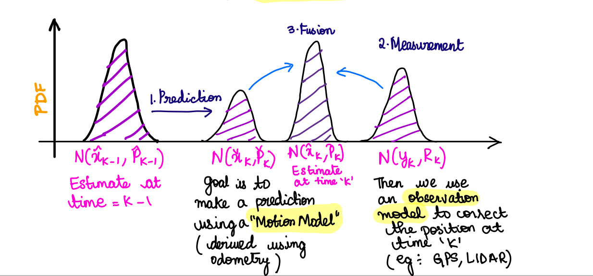
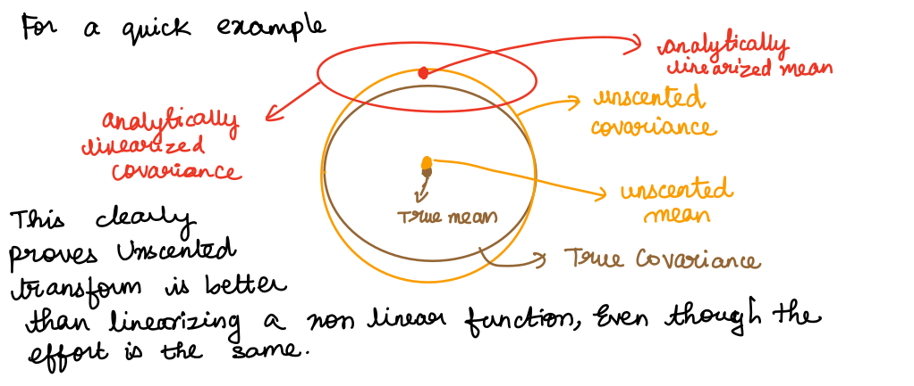

# Unscented Kalman Filter 

This repository contains code for UKF implementation in python for simulated data 

The Goal of a Kalman Filter is to take a Probabilistic Estimate of the state and update it in real time in two steps, Prediction and Correction Step.

​                                                  
​     

## Unscented Transform 

Its always easier to approximate a probability function rather than an arbitrary non-linear function. 



Since there is no linearization error, No computation of jacobian, which leads to higher accuracy and better speed the UKF is always a better option compared to EKF when the system is non-linear.


#### Further Information about UKF can be found in the file Non_Linear_Kalman _Filter_Unscented_Kalman__Fliter.pdf


## Data :

##### Simulated data using a simple motion model and some noise. This simulated data was inspired from https://github.com/AtsushiSakai/PythonRobotics. 


## Setup : 

### Step 1 : Setting up Perquisites 

```
pip install numpy 
pip install matplotlib
pip install matplotlib
pip install easydict
pip install scipy
```

### Step 2 : Setting up parameters in the yaml file.

Setup the variance, data file path and other parameters in the yaml file. 

### Step 3 : Running main.py 

```
python main.py 
```


## Results : 

          

 


